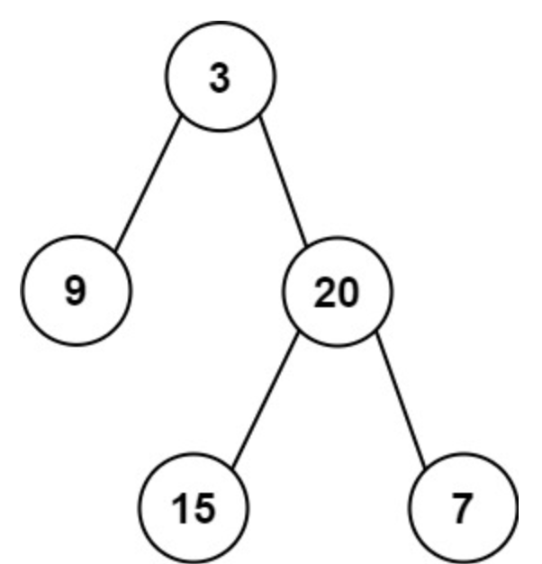

# 二叉树相关

## 根据前序和中序排列构造出一个二叉树

leetcode105

> 给定两个整数数组preorder和inorder，其中preorder是二叉树的先序遍历，inorder是同一棵树的中序遍历，请构造二叉树并返回其根节点。

示例：



```context
输入: preorder = [3,9,20,15,7], inorder = [9,3,15,20,7]
输出: [3,9,20,null,null,15,7]
```

分析：

前序遍历的遍历顺序是根节点->左节点->右节点，中序遍历的顺序是左节点->根节点->右节点。根据先序遍历，我们可以先找到根节点的值preorder[0]，然后再去inorder中找到这个根节点，inorder中根节点左边是左子树的中序遍历，根节点右边是右子树的中序遍历。设左子树长度为l1，右子树长度为l2，再去先序遍历preorder中根据长度找到左右子树的先序遍历，随后进行递归建树。

代码如下：

```java

```


